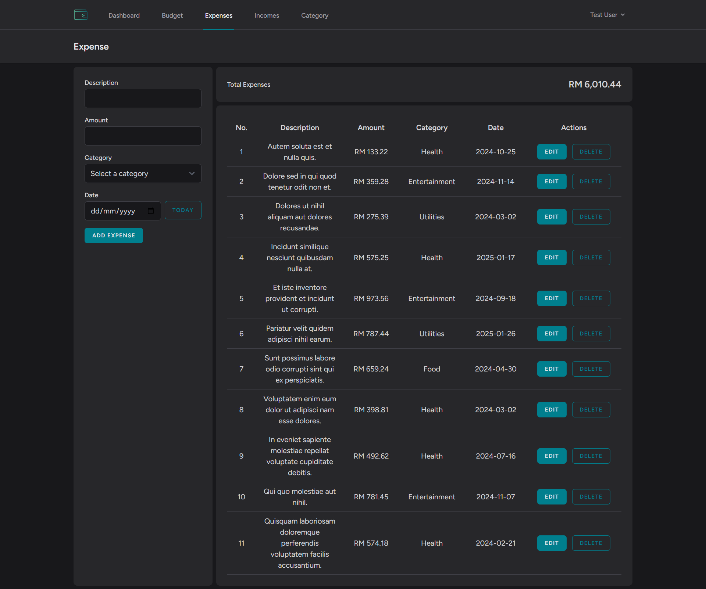

# DompetFlow - Personal Expense Tracker

## Overview
DompetFlow is a personal expense tracker built using Laravel, Livewire, and Tailwind CSS. It helps users manage their income, expenses, and budgets efficiently while providing insightful reports and visualizations.

## Features
- **Income & Expense Management**: Easily track income sources and expenses.
- **Budgeting**: Set monthly budgets for different categories.
- **Reports & Charts**: Visual representation of spending trends.
- **Category Management**: Organize transactions into categories.
- **User Authentication**: Secure login and registration.

## Technologies Used
- Laravel
- Livewire
- Tailwind CSS
- MySQL
- Chart.js (for data visualization)

## Screenshots
- Dashboard

- Expense

- Income

- Budget

## About the Project
This project was built as a personal tool for managing finances and is featured in my portfolio. It showcases my skills in Laravel, Livewire, and Tailwind CSS.

## Contact
If you'd like to learn more about this project, feel free to connect with me!

hadhirah43@gmail.com | [LinkedIn](https://www.linkedin.com/in/nurul-hadhirah-hazuddin-a9028b300/) | [Portfolio](https://hadhihazu.github.io/portfolio-hadhirah/) | [GitHub](https://github.com/hadhihazu)
